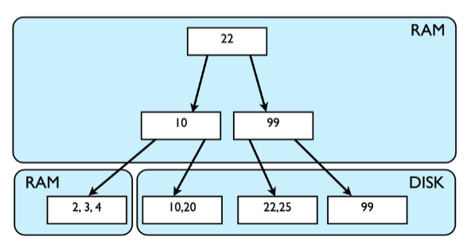
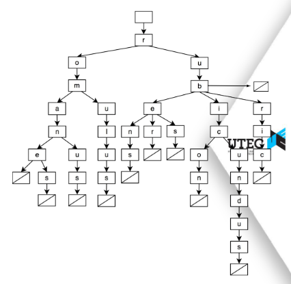

# BTree B+ Tree and Trie
Implementation of  Btree B+ Tree and Trie
## Integrantes:
- Fabryzzio Jossue Meza Torres
- Fernando Alonso Usurin Arias
- Yoselyn Victoria Miranda Chirinos
## BTree B+

## Trie

## Referencias APA
- Presentación 09(Tries).(2024). Ojeda,B., *Algoritmo y estructura de datos: CS2023* (págs. 1-17).UTEC
- Presentación 10(Árboles B).(2024). Ojeda,B., *Algoritmo y estructura de datos: CS2023* (págs. 1-30).UTEC
